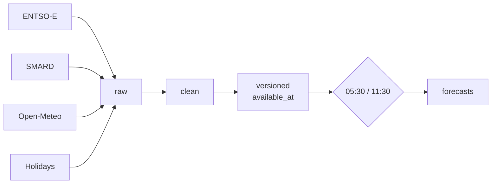

# delukit

Day-ahead and 10-day power forecasts for the DE-LU zone. Load, solar, wind on/offshore, total generation, day-ahead price. Rebuilt at 05:30 and 11:30 Berlin time, served as chart, API and export.

## Run with Docker

```bash
cp .env.example .env  # add ENTSOE_API_KEY
docker compose up --build
```

App on http://localhost:8000, pipeline UI on http://localhost:3000.

## Develop without Docker

Python ≥3.12 with `uv`, Node 22.

```bash
uv sync
uv run delukit && uv run delukit-clean && uv run delukit-dataset
uv run delukit-forecast --gate 1130 --span d1
```

```bash
cd delu && uv sync && uv run uvicorn backend.app:app --port 8000
cd delu/frontend && npm ci && npm run dev
```

Dagster UI:

```bash
mkdir -p data/.dagster && export DAGSTER_HOME=$PWD/data/.dagster
uv run dagster dev -m delukit.dagster_app.definitions -p 3000
```

## How it flows



Raw provider payloads → quarter-hour clean tables → point-in-time versioned parts → 24 XGBoost models (6 targets × 2 gates × 2 spans) → parquet + plots in `data/forecasts`. Every row knows when it became known, so gates never train on the future. Serving lives in `delu/` — diagram there.

## CLI

| Command | Does |
|---|---|
| `delukit` | Sync ENTSO-E, SMARD, weather, calendar into `data/raw` |
| `delukit-clean` | Raw → `data/clean/*.parquet` |
| `delukit-dataset` | Clean → `data/versioned` + gate-replay validation (`--validate-only` to just check) |
| `delukit-forecast` | Fit + predict one gate, e.g. `--gate 1130 --span d1 [--date 2026-09-21]` |
| `delukit-backtest` | Replay a product over history, score per lead day |
| `delukit-tune` | Optuna-tune one product into `data/tuning` |

## API

```bash
curl 'localhost:8000/api/forecast?span=d1&target=load_actual_mw&type=probabilistic'

curl -H 'X-API-Key: delu_live_...' \
  'localhost:8000/v1/forecast?span=d10&target=gen_actual_photovoltaics_mwh&type=probabilistic'

curl -b cookies.txt \
  'localhost:8000/api/export?start=2026-09-01&end=2026-09-15&target=load_actual_mw&gate=1130&kind=point&tz=Europe/Berlin&horizon_days=1&format=csv' -o export.csv
```

Anonymous `/api/*` is rate-limited per IP. `/v1/*` needs a key: 60/min, 5000/day. Full reference in [delu/README](delu/README.md).

## Project structure

```
src/delukit/
  main.py clean.py dataset.py forecast.py backtest.py tune.py
  core/         # grain, config, availability, products
  sources/      # entsoe, smard, weather, calendar
  dagster_app/  # assets, schedules, checks, run.py
delu/
  backend/      # FastAPI app
  frontend/     # React app
tests/ delu/tests/
compose.yaml Dockerfile delu/Dockerfile
data/           # gitignored: raw, clean, versioned, forecasts, scores, mlflow
```

## Operations

- 05:30 + 11:30 daily — full chain: sync → clean → versioned → both spans
- 15:30 daily — score yesterday's gates against arrived actuals
- Sunday 02:00 — retrain all products, registry keeps the champion
- 1st of month 03:00 — re-tune all products

Versioned-data check blocks forecasts on bad data. Forecast writes are idempotent, partitions retry twice, failures append to `data/ops/alerts.log` and POST `DELUKIT_ALERT_WEBHOOK` when set.

## Configuration

`.env.example` → `.env`. The only required key is `ENTSOE_API_KEY`.

| Variable | Purpose |
|---|---|
| `RESEND_API_KEY` | Verify + contact mail (falls back to SMTP, logs locally if empty) |
| `DELU_PUBLIC_URL` | Host baked into verify links |
| `DELUKIT_ALERT_WEBHOOK` | Slack alert on failed runs |
| `DELU_COOKIE_SECURE` | Set `1` over https |

## Data attribution

ENTSO-E Transparency · SMARD · Open-Meteo ECMWF IFS · OpenHolidays. Forecasts are model output, not trading advice.

## Contributing

Small PRs with a test. `uv run pytest -q` at root and in `delu/`, `npm run lint` in the frontend. New providers follow the existing `sync` / `fetch_day` / `to_clean` shape.

---

Built by [Bhanu Prasanna](mailto:bhanu.prasanna2001@gmail.com) — forecasts that respect what was known when.
