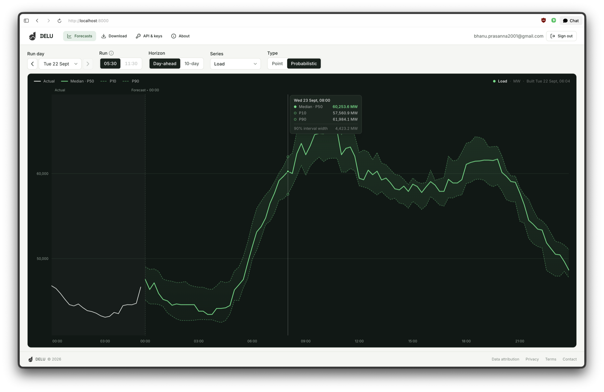
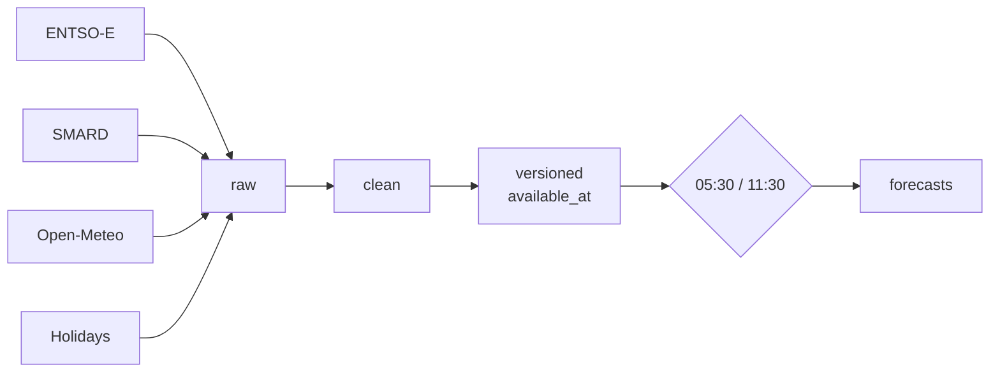

<div align="center">


# ⚡ delukit

**Day-ahead & 10-day power forecasts for the DE-LU zone — load, solar, wind, generation, price.**

Rebuilt at **05:30** and **11:30** Berlin time · served as chart, API & export

[](pyproject.toml)
[](src/delukit/dagster_app/)
[](delu/backend/)
[](delu/frontend/)
[](compose.yaml)

[🚀 Quickstart](#-quickstart-60-seconds) ·
[📊 What you get](#-what-you-get) ·
[🔄 How it flows](#-how-it-flows) ·
[⌨️ CLI](#️-cli) ·
[🔌 API](delu/README.md)

</div>

---

<p align="center">
  
  <br />
  <sub>The app at <code>:8000</code> — P10/P50/P90 bands, actuals overlay, run-day stepper.</sub>
</p>

## ✨ Why delukit

- 🔮 **24 XGBoost models** — 6 targets × 2 gates × 2 spans, point *and* probabilistic
- 🕰️ **Observed cutoffs** - provider responses carry fetch times; strict replay rejects history without proven vintages
- ⚡ **Two forecasts a day** - refresh before 05:30 / 11:30 Berlin gates, then predict from the committed snapshot
- 📈 **1-day + 10-day horizons** — day-ahead precision meets 10-day planning
- 📦 **One command to run** — `docker compose up --build` gives you app + pipeline
- 🔑 **API with keys & quotas** — anonymous exploration, keyed `/v1` for real use

> Forecasts are model output, **not trading advice**.

## 📊 What you get

| Surface | Where | What |
|---|---|---|
| 📈 Forecast chart | `http://localhost:8000` | P10/P50/P90 bands, actuals, 05:30/11:30 toggle, D+1 / 10-day switch |
| 📥 Self-serve export | `/api/export` | CSV / Parquet / XLSX by range, horizon, timezone — verified login only |
| 🔑 API + dashboard | `/v1/forecast` | Keyed endpoint (60/min, 5000/day), usage bar, in-app Swagger |
| 🛠️ Pipeline UI | `http://localhost:3000` | Dagster asset graph, schedules, checks, retries |

<p align="center">
  
  <br />
  <sub>Six assets, five schedules - refresh precedes both gates and the 15:30 completed-day evaluation.</sub>
</p>

## 🚀 Quickstart — 60 seconds

```bash
cp .env.example .env  # add ENTSOE_API_KEY
docker compose up --build
```

App → http://localhost:8000 · Pipeline → http://localhost:3000

That's it. The only required key is `ENTSOE_API_KEY`.

## 🔄 How it flows



Raw provider observations → quarter-hour clean tables → conservatively timestamped versioned parts → **24 product workflows** → parquet + plots in `data/forecasts`. Serving lives in [`delu/`](delu/README.md) in one FastAPI process.

Old raw files are stamped with the time this version first observes them. That time does not reconstruct earlier provider revisions. Strict backtests reject windows without sufficient observation history; see [the architecture and migration contract](docs/architecture.md).

## ⌨️ CLI

| Command | Does |
|---|---|
| `delukit` | Refresh the recent provider window into `data/raw`; `--since YYYY-MM-DD` repairs older dates |
| `delukit-clean` | Raw → `data/clean/*.parquet` |
| `delukit-dataset` | Clean → `data/versioned` + gate-replay validation (`--validate-only` to just check) |
| `delukit-forecast` | Fit + predict a live gate, e.g. `--gate 1130 --span d1` |
| `delukit-backtest` | Replay a product over history, score per lead day |
| `delukit-tune` | Optuna-tune one product into `data/tuning` |

## 🔌 API taste

```bash
# anonymous, rate-limited per IP
curl 'localhost:8000/api/forecast?span=d1&target=load_actual_mw&type=probabilistic'

# keyed — 60/min, 5000/day
curl -H 'X-API-Key: delu_live_...' \
  'localhost:8000/v1/forecast?span=d10&target=gen_actual_photovoltaics_mwh&type=probabilistic'

# export — verified login, cookies included
curl -b cookies.txt \
  'localhost:8000/api/export?start=2026-09-01&end=2026-09-15&target=load_actual_mw&gate=1130&kind=point&tz=Europe/Berlin&horizon_days=1&format=csv' -o export.csv
```

Full reference in [`delu/README`](delu/README.md).

## 🗂️ Project structure

```
src/delukit/
  main.py clean.py dataset.py forecast.py backtest.py tune.py
  core/         # grain, config, availability, products
  sources/      # entsoe, smard, weather, calendar
  dagster_app/  # assets, schedules, checks, run.py
delu/
  backend/      # FastAPI app
  frontend/     # React app
tests/ delu/tests/
compose.yaml Dockerfile delu/Dockerfile
data/           # gitignored: raw, clean, versioned, forecasts, scores, mlflow
```

## 🛠️ Develop without Docker

Python ≥3.12 with `uv`, Node 22.

```bash
uv sync
uv run delukit && uv run delukit-clean && uv run delukit-dataset
uv run delukit-forecast --gate 1130 --span d1
```

```bash
cd delu && uv sync && uv run uvicorn backend.app:app --port 8000
cd delu/frontend && npm ci && npm run dev
```

Dagster UI:

```bash
mkdir -p data/.dagster && export DAGSTER_HOME=$PWD/data/.dagster
uv run dagster dev -m delukit.dagster_app.definitions -p 3000
```

## ⏰ Operations

| Schedule | Runs |
|---|---|
| 05:00, 11:00, 15:00 daily | Refresh sources and commit a validated dataset before each dependent run |
| 05:30 + 11:30 daily | Forecast both spans from the committed pre-gate snapshot |
| 15:30 daily | Score yesterday's completed Berlin delivery day and send one Slack digest |
| Sunday 04:00, optional | Retrain all products if the schedule is enabled |
| 1st of month 03:00, optional | Re-tune all products if the schedule is enabled |

The refresh, gate, and score schedules start enabled. A validated snapshot marker blocks gates and scoring if refresh missed its window or left partial files. Failed runs append to `data/ops/alerts.log` and POST `DELUKIT_ALERT_WEBHOOK` when set. The 15:30 digest reports score coverage, metrics, and fallback counts. Weekly retraining and monthly tuning remain opt-in.

## ⚙️ Configuration

`.env.example` → `.env`. Only `ENTSOE_API_KEY` is required.

| Variable | Purpose |
|---|---|
| `RESEND_API_KEY` | Verify + contact mail (falls back to SMTP, logs locally if empty) |
| `DELU_PUBLIC_URL` | Host baked into verify links |
| `DELUKIT_ALERT_WEBHOOK` | Slack failed-run alerts and 15:30 score digest |
| `DELU_COOKIE_SECURE` | Set `1` over https |

## 🙏 Data attribution

ENTSO-E Transparency · SMARD · Open-Meteo ECMWF IFS · OpenHolidays.

## 🤝 Contributing

Small PRs with a test. `uv run pre-commit install` once, then `uv run pytest -q` at root and in `delu/`, `npm run lint` in the frontend. Merging needs `all-checks-passed` green. New providers follow the existing `sync` / `fetch_day` / `to_clean` shape.

---

<div align="center">
  <sub>Built by <a href="mailto:bhanu.prasanna2001@gmail.com">Bhanu Prasanna</a> — forecasts that respect what was known when.</sub>
</div>
