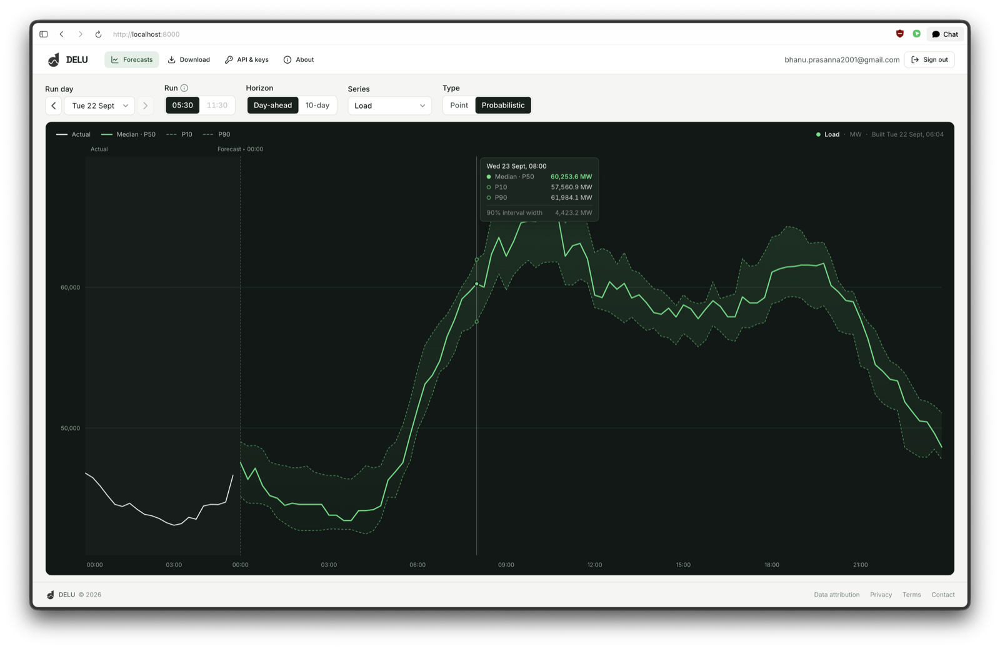
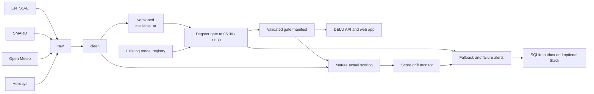

<div align="center">


# ⚡ delukit

**Day-ahead & 10-day power forecasts for the DE-LU zone — load, solar, wind, generation, price.**

Rebuilt at **05:30** and **11:30** Berlin time · served as chart, API & export

[](pyproject.toml)
[](src/delukit/dagster_app/)
[](delu/backend/)
[](delu/frontend/)
[](compose.yaml)

[🚀 Quickstart](#-quickstart-60-seconds) ·
[📊 What you get](#-what-you-get) ·
[🔄 How it flows](#-how-it-flows) ·
[⌨️ CLI](#️-cli) ·
[🔌 API](delu/README.md)

</div>

---

<p align="center">
  
  <br />
  <sub>The app at <code>:8000</code> — P10/P50/P90 bands, actuals overlay, run-day stepper.</sub>
</p>

## ✨ Why delukit

- 🔮 **24 forecast products** — 6 targets × 2 gates × 2 spans, with XGBoost where a usable model exists
- 🕰️ **Modeled gate cutoffs.** Every row has an assigned availability time
- ⚡ **Two fresh forecasts a day** — full chain runs at 05:30 / 11:30 Berlin time
- 📈 **1-day + 10-day horizons** — day-ahead precision meets 10-day planning
- 📦 **One command to run** — `docker compose up --build` gives you app + pipeline
- 🔑 **API with keys & quotas** — anonymous exploration, keyed `/v1` for real use

> Forecasts are model output, **not trading advice**.

## 📊 What you get

| Surface | Where | What |
|---|---|---|
| 📈 Forecast chart | `http://localhost:8000` | P10/P50/P90 bands, actuals, 05:30/11:30 toggle, D+1 / 10-day switch |
| 📥 Self-serve export | `/api/export` | CSV / Parquet / XLSX by range, horizon, timezone — verified login only |
| 🔑 API + dashboard | `/v1/forecast` | Keyed endpoint (60/min, 5000/day), usage bar, in-app Swagger |
| 🛠️ Pipeline UI | `http://localhost:3000` | Dagster asset graph, schedules, checks, retries |

## 🚀 Quickstart — 60 seconds

```bash
cp .env.example .env  # add ENTSOE_API_KEY
docker compose up --build
```

App → http://localhost:8000 · Pipeline → http://localhost:3000

That's it. The only required key is `ENTSOE_API_KEY`.

## 🔄 How it flows


```mermaid
flowchart LR
    E[ENTSO-E] --> R[raw]
    S[SMARD] --> R
    W[Open-Meteo] --> R
    H[Holidays] --> R
    R --> C[clean]
    C --> V[versioned\navailable_at]
    V --> G[Dagster gate at 05:30 / 11:30]
    M[Existing model registry] --> G
    G --> P[Validated gate manifest]
    P --> A[DELU API and web app]
    P --> Q[Mature actual scoring]
    C --> Q
    Q --> D[Score drift monitor]
    G --> L[Fallback and failure alerts]
    D --> L
    L --> K[SQLite outbox and optional Slack]
```

Raw provider payloads → quarter-hour clean tables → availability-stamped parts → model predictions → validated parquet and a gate manifest in `data/forecasts`. Plots are optional (`DELUKIT_WRITE_PLOTS=1`). Serving lives in [`delu/`](delu/README.md). One FastAPI process serves the UI and API. Each product records its model label; a missing registry model produces an `xgboost_unregistered` forecast and an alert instead of silently writing a new champion.

`available_at` applies configured publication times to retained values. ENTSO-E and SMARD refreshes replace each daily file, so historical replay uses the latest retained revision. It cannot reconstruct the value seen at an earlier gate. Weather retains separate model runs.

## ⌨️ CLI

| Command | Does |
|---|---|
| `delukit` | Sync ENTSO-E, SMARD, weather, calendar into `data/raw` |
| `delukit-clean` | Raw → `data/clean/*.parquet` |
| `delukit-dataset` | Clean → `data/versioned` + gate-replay validation (`--validate-only` to just check) |
| `delukit-forecast` | Fit + predict both spans for one gate, e.g. `--gate 1130 [--date 2026-09-21]` |
| `delukit-backtest` | Replay a product over history, score per lead day |
| `delukit-tune` | Optuna-tune one product into `data/tuning/candidates` |

## 🔌 API taste

```bash
# anonymous, rate-limited per IP
curl 'localhost:8000/api/forecast?span=d1&target=load_actual_mw&type=probabilistic'

# keyed — 60/min, 5000/day
curl -H 'X-API-Key: delu_live_...' \
  'localhost:8000/v1/forecast?span=d10&target=gen_actual_photovoltaics_mwh&type=probabilistic'

# export — verified login, cookies included
curl -b cookies.txt \
  'localhost:8000/api/export?start=2026-09-01&end=2026-09-15&target=load_actual_mw&gate=1130&kind=point&tz=Europe/Berlin&horizon_days=1&format=csv' -o export.csv
```

Full reference in [`delu/README`](delu/README.md).

## 🗂️ Project structure

```
src/delukit/
  core/         # shared time, schemas, product and availability policy
  sources/      # provider adapters and sync
  data/         # clean and versioned dataset builds
  models/       # fit, predict, tuning
  evaluation/   # historical replay and mature actual scoring
  ops/          # publication, monitoring, alert delivery
  dagster_app/  # orchestration only
delu/
  backend/      # FastAPI app
  frontend/     # React app
tests/ delu/tests/
compose.yaml compose.prod.yaml deploy/ Dockerfile delu/Dockerfile
data/           # gitignored: raw, clean, versioned, forecasts, scores, mlflow
```

## 🛠️ Develop without Docker

Python ≥3.12 with `uv`, Node 22.

```bash
uv sync
uv run delukit && uv run delukit-clean && uv run delukit-dataset
uv run delukit-forecast --gate 1130
```

```bash
cd delu && uv sync && uv run uvicorn backend.app:app --port 8000
cd delu/frontend && npm ci && npm run dev
```

Dagster UI:

```bash
mkdir -p data/.dagster && export DAGSTER_HOME=$PWD/data/.dagster
uv run dagster dev -m delukit.dagster_app.definitions -p 3000
```

## Development checks

From the repository root, `scripts/verify` installs selected Python and frontend dependencies from their lockfiles and runs the complete local check set. CI calls the same command by group. Use `scripts/verify --list` to see the available groups and checks.

```bash
scripts/verify
scripts/verify --group python-root
scripts/verify --check delu-pytest --check frontend-lint
```

The command reports every selected result and exits nonzero if a check fails or its setup cannot complete. `all-checks-passed` is the stable CI status to require for merging.

## ⏰ Operations

| Schedule | Runs |
|---|---|
| 🌅 05:30 + 11:30 daily | Full chain: sync → clean → versioned → both spans |
| 🧮 15:30 daily | Reconcile complete lead-day scores for the preceding eleven issue dates |

Automatic retraining and tuning are disabled. The old registry callback compared candidate and incumbent on training data, and retained ENTSO-E/SMARD history does not preserve historical revisions. `delukit-tune` writes candidate settings only; `delukit-backtest --tuned` can explore them but is not promotion evidence. A future promotion job needs immutable source receipts, a forward holdout, champion comparison, and a reversible active-model pointer. Existing registry models are read for scheduled predictions, with local unregistered XGBoost or simpler fallback models when needed.

The versioned-data check blocks forecasts on failed validation. A gate becomes public only after every product has a complete, finite, ordered forecast grid. Failed source fetches fail the gate. Alerts for failed runs, missed publications, fallback models, and mature-score drift go to `data/ops/alerts.db` and optionally Slack. The 1.5× score-drift threshold is provisional and needs calibration against held-out history.

## Remote deployment

[Deploy on an Always Free VM](deploy/README.md) runs the existing Docker stack remotely with HTTPS, private Dagster access, persistent state, and encrypted off-VM backups. OCI capacity and uptime are not guaranteed. The repository does not contain cloud account credentials or a live deployment.

## ⚙️ Configuration

`.env.example` → `.env`. Local Compose only needs `ENTSOE_API_KEY`. Public deployment also needs a domain and working verification mail.

| Variable | Purpose |
|---|---|
| `RESEND_API_KEY` | Verify + contact mail (falls back to SMTP, logs locally if empty) |
| `DELU_PUBLIC_URL` | Host baked into verify links |
| `DELUKIT_ALERT_WEBHOOK` | Slack alert on failed runs |
| `DELU_COOKIE_SECURE` | Set `1` over https |

## 🙏 Data attribution

ENTSO-E Transparency · SMARD · Open-Meteo ECMWF IFS · OpenHolidays.

## 🤝 Contributing

Small PRs with a test. `uv run pre-commit install` once, then `uv run pytest -q` at root and in `delu/`, `npm run lint` in the frontend. Merging needs `all-checks-passed` green. New providers follow the existing `sync` / `fetch_day` / `to_clean` shape.

---

<div align="center">
  <sub>Built by <a href="mailto:bhanu.prasanna2001@gmail.com">Bhanu Prasanna</a> · forecasts gated by modeled availability.</sub>
</div>
