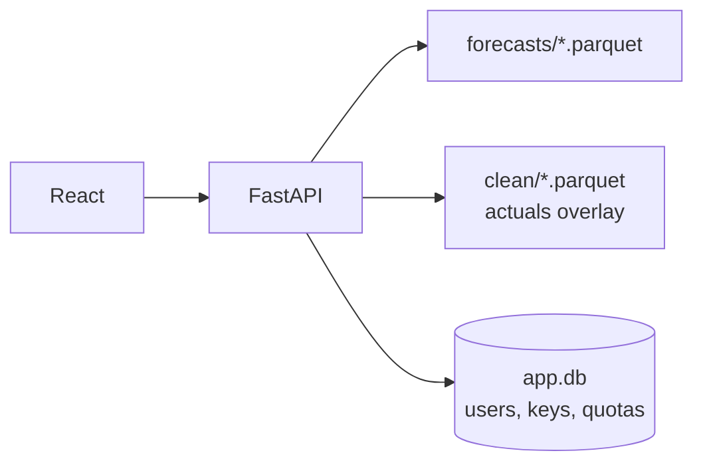

# delu

Serving layer for delukit. Reads stored forecasts off disk, renders them in the browser, hands them out over one keyed endpoint.

## How it serves



The frontend builds to `backend/static`, so one process on `:8000` serves UI and API.

## Run it

```bash
cd delu && uv sync && uv run uvicorn backend.app:app --port 8000
cd frontend && npm ci && npm run dev
```

`GET /healthz` → `{"ok": true}`.

## API reference

```bash
GET /api/options
# dates, gates, spans, targets, per-day runs

GET /api/forecast?date&gate&span&target&type
# type=point | probabilistic. date/gate default to latest.

GET /v1/forecast?date&gate&span&target&type
# same, keyed:  X-API-Key: delu_live_...  or  Authorization: Bearer ...
# 60/min + 5000/day per key. Spec: /openapi-forecast.json

GET /api/export?start&end&target&gate&kind&tz&horizon_days&format
# kind=point | probabilistic, tz=Europe/Berlin | UTC,
# horizon_days=1..10, format=csv | parquet | xlsx. Verified login only.
```

Forecast responses carry `timestamps`, `p50`, `p10`/`p90`, `actual`, and `meta.model` — anything other than `xgboost` is fallback output, labelled degraded in the UI.

Auth: `POST /auth/signup` → verify link → `GET /auth/verify` issues the key. `POST /auth/login`, `GET /auth/me`, `POST /v1/keys/refresh`, `DELETE /auth/account`. One active key per user; refresh carries the day's usage over. Mail goes over Resend, else SMTP, else the log.
