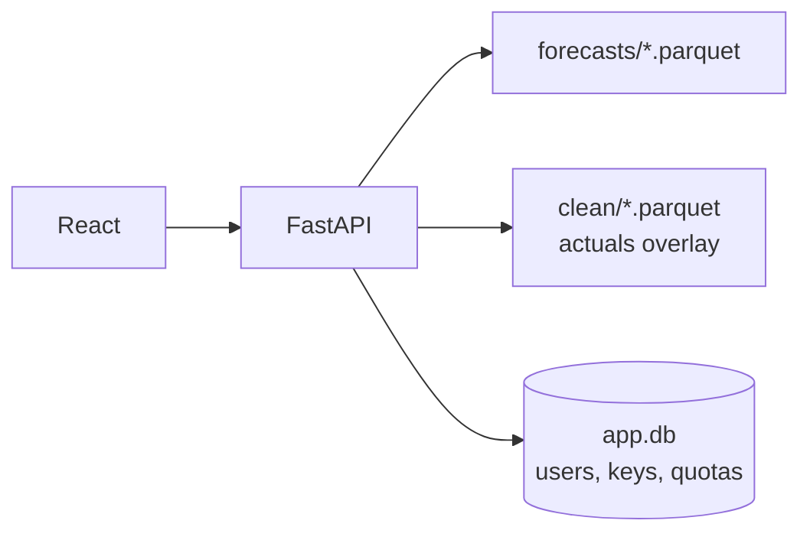

<div align="center">


# 🍰 delu — serving layer

**One FastAPI process serves the chart, the export, and the keyed API.**

[](backend/app.py)
[](frontend/)
[](backend/db.py)

[⬆️ Back to delukit](../README.md) · [🎨 Frontend](frontend/README.md)

</div>

---

## ⚙️ How it serves



The frontend builds to `backend/static`, so **one process on `:8000`** serves UI *and* API. Forecasts come off disk — no model runs at request time.

> Anything other than `meta.model: xgboost` is fallback output, labelled **degraded** in the UI.

## 🚀 Run it

```bash
cd delu && uv sync && uv run uvicorn backend.app:app --port 8000
cd frontend && npm ci && npm run dev
```

`GET /healthz` → `{"ok": true}`.

## 🔌 API reference

| Endpoint | Auth | Example |
|---|---|---|
| `GET /api/options` | none | dates, gates, spans, targets, per-day runs |
| `GET /api/forecast?date&gate&span&target&type` | none, IP rate-limited | `?span=d1&target=load_actual_mw&type=probabilistic` |
| `GET /v1/forecast?date&gate&span&target&type` | `X-API-Key` or `Bearer` · 60/min + 5000/day | spec at `/openapi-forecast.json` |
| `GET /api/export?start&end&target&gate&kind&tz&horizon_days&format` | verified login (cookie) | `kind=point\|probabilistic`, `tz=Europe/Berlin\|UTC`, `horizon_days=1..10`, `format=csv\|parquet\|xlsx` |

```bash
GET /api/options
# dates, gates, spans, targets, per-day runs

GET /api/forecast?date&gate&span&target&type
# type=point | probabilistic. date/gate default to latest.

GET /v1/forecast?date&gate&span&target&type
# same, keyed:  X-API-Key: delu_live_...  or  Authorization: Bearer ...
# 60/min + 5000/day per key. Spec: /openapi-forecast.json

GET /api/export?start&end&target&gate&kind&tz&horizon_days&format
# kind=point | probabilistic, tz=Europe/Berlin | UTC,
# horizon_days=1..10, format=csv | parquet | xlsx. Verified login only.
```

Forecast responses carry `timestamps`, `p50`, `p10`/`p90`, `actual`, and `meta.model`.

## 🔐 Auth & keys

`POST /auth/signup` → verify link → `GET /auth/verify` issues the key. Then `POST /auth/login`, `GET /auth/me`, `POST /v1/keys/refresh`, `DELETE /auth/account`.

- One active key per user; **refresh carries the day's usage over**
- Mail goes over Resend → SMTP → local log (first configured wins)

---

<div align="center">
  <sub>Serving lives here · forecasting lives in <a href="../README.md">delukit</a> · UI lives in <a href="frontend/README.md">frontend</a></sub>
</div>
