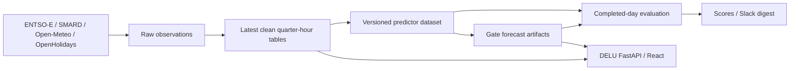

# Delukit architecture and migration

This document records the system boundary, the observed failure modes, and the migration contract as of 23 September 2026. A historical provider value is not proven to have been available at a forecast gate merely because its delivery timestamp predates that gate.

## System and domain boundaries

| Concept | Meaning | Identity |
| --- | --- | --- |
| Valid time | Quarter for which an energy value or weather forecast applies | UTC timestamp |
| Observation | A response actually fetched from a provider | Source, product, request period, fetch time, payload hash |
| Known time | Earliest defensible time this system possessed that response | UTC `known_at`; never inferred from valid time |
| Forecast origin | One Berlin date at 05:30 or 11:30 | `(origin_day, gate)` |
| Product | Model output for one target and span | `(target, gate, d1 or d10)` |
| Delivery day | Berlin civil date being predicted and later evaluated | Local date, with 92, 96, or 100 quarters |
| Lead day | Delivery date minus forecast origin date | `1` through `10` |
| Complete score | Metric over every expected quarter with eligible truth | `(delivery_day, origin_day, gate, span, lead_day, target)` |

The toolkit under `src/delukit` owns collection, transformation, modeling, orchestration, scoring, and files under `data/`. DELU under `delu/` owns account and key state in SQLite, serving stored forecasts and actuals, exports, and the browser UI. DELU does not train models. `compose.yaml` shares `data/` read-only with DELU and read-write with the pipeline. `energy_charts.py` is an implemented source adapter but is not in the active `SOURCES` map.

The code dependency direction is `core/config` and `core/clean` → `sources` → `clean` → `dataset` → `forecast` and `backtest` → `dagster_app`. DELU reads the resulting files through its own `backend/forecasts.py`; it does not import the modeling package. Dagster and the CLIs invoke the same Python functions.

## Provider and data schemas

| Provider | Request identity and response | Canonical clean content |
| --- | --- | --- |
| ENTSO-E | API-keyed GET for a DE-LU UTC period and one configured document category; XML time series, including SDAC sequence and generation PSR codes. | `load_actual_mw`, `load_forecast_mw`, `price_exaa_eur_mwh`, `price_sdac_seq1/seq2_eur_mwh`, generation actuals and forecasts in MW. |
| SMARD | POST for DE-LU quarter-hour resolution, module IDs, and a Berlin civil day; XML component values assigned positionally to that day's DST-aware quarter grid. | `load_actual/forecast_mwh`, `price_day_ahead_eur_mwh`, component generation actuals and forecasts in MWh. |
| Open-Meteo | GET for one ECMWF IFS 00z run, land or sea cell group, and forecast fields; JSON hourly values with a model initialization distinct from first API availability. | `(run_day, location, timestamp_utc)` rows containing temperature, wind speed/direction, radiation, cloud cover, and location metadata. |
| OpenHolidays | GET public and school holidays by DE or LU, year and category; daily JSON is cached and refreshed. | Quarter rows with country flags and combined holiday, working-day, bridge-day, and school-break fields. Only deterministic weekday/weekend enter the current versioned predictors. |

ENTSO-E, SMARD, and calendar clean tables use UTC quarter indexes. The weather clean table keeps its native UTC valid hour for each run and location; the versioned build expands it to quarters. `timestamp_berlin`, `date`, and `quarter` calendar columns appear where applicable. Missing provider values remain null. The versioned layer splits these tables into nine named parts with feature columns and UTC `available_at`; measured values use a reporting delay, published curves use a conservative publication wall time, and all observed values are raised to their actual response observation time. Raw observation metadata records `known_at`, `fetched_at`, `source_issued_at` when present, `payload_hash`, `semantic_hash`, and the immutable payload path. This metadata is evidence of a fetched revision; a provider's nominal issue time alone is not evidence of availability.

Forecast Parquet uses a UTC quarter index, the target column, and `quantile_P10`, `quantile_P50`, `quantile_P90`. Score Parquet has one row per `(delivery_day, origin_day, gate, span, lead_day, target)` with `as_of`, `truth_basis`, status/reason, expected/forecast/truth/matched counts, rMAE, rCRPS, and observed quantile probabilities. Incomplete rows have null metrics.

## Side effects and contracts

| Boundary | Input and side effect | Failure rule |
| --- | --- | --- |
| Providers | ENTSO-E GET/XML with API key; SMARD POST/XML; Open-Meteo GET/JSON model run; OpenHolidays GET/JSON | Timeouts, HTTP failures, malformed payloads, and missing required freshness must be visible to orchestration. No provider I/O during model prediction. |
| Raw filesystem | `data/raw/<day>/<source>/<category>/data.xml` or `data.json` remains the latest compatibility view. Immutable response bytes and observation metadata live beside it. | A changed provider response must retain its earlier observation; an unchanged response may add freshness evidence. Writes must complete before becoming visible. |
| Clean filesystem | `data/clean/{entsoe,smard,weather,calendar}.parquet`; energy and calendar use UTC quarters, weather uses native UTC hours per run and location. Current parsers produce the latest provider values. | Schema drift fails the dataset build instead of silently dropping a column. These files are useful as latest values and evaluation truth, not historical predictor vintages by themselves. |
| Versioned filesystem | `data/versioned/<part>.parquet`, each part a quarter-indexed OpenSTEF `TimeSeriesDataset` with feature columns and UTC `available_at`. | A value observed after a gate must have `available_at` after that gate. Missing provenance fails a strict build or replay. |
| Forecast filesystem | `data/forecasts/<origin_day>/<gate>_/<target>__<model>.parquet`, UTC quarter index with `quantile_P10/P50/P90` and target column. | Each file is atomically replaced and the asset checks the set afterward. A failed multi-target run can leave a partial set, so serving should eventually consume a run-level commit marker. Historical replay cannot overwrite an operational forecast. |
| Score filesystem | Delivery-day rows under `data/scores`, with coverage/status as well as metrics. | A partial or missing day is never written as a complete metric. Retry with the same cutoff reuses the recorded rows, so later truth revisions do not rewrite an evaluation. |
| Model registry | MLflow stores model artifacts; tuning parameters are JSON under `data/tuning`. | A reused model needs a provable training cutoff no later than its forecast origin. Without that metadata, gate fitting must avoid reuse or selection of a later model. |
| External messages | `DELUKIT_ALERT_WEBHOOK` sends a Slack JSON digest and failure alerts. Contact and verification mail use Resend or SMTP, falling back to local logging. | Secrets stay in environment variables. Failed alert transport must be logged without hiding the original pipeline failure. |

Provider publication rules in `core/config/availability.py` are lower bounds, not proof of a particular fetched revision's availability. [Open-Meteo distinguishes run initialization from API availability](https://open-meteo.com/en/docs/model-updates), and both differ from our fetch time. Holiday flags from OpenHolidays can change; weekday and weekend are deterministic calendar features. [SMARD also revises historical series](https://www.smard.de/resource/blob/220052/9d526adf4b948599da4a956dfae6dab9/smard-benutzerhandbuch-04-2026-data.pdf). Source refresh therefore uses a bounded frequent window plus an explicit older repair path.

## Dagster and time contracts

`raw_data` → `clean_data` → `versioned_data` is the data chain. Forecast assets consume a committed versioned dataset and write `d1` and `d10` products for a Berlin origin and gate. Evaluation consumes stored forecast files and eligible truth; its partition is a **delivery day**, since one delivery day requires forecasts from several origins. Gate partitions and delivery-day partitions cannot be treated as interchangeable.

The operational clocks are Europe/Berlin wall time, including DST changes: source refresh at 05:00, 11:00, and 15:00; forecast origins at 05:30 and 11:30; evaluation at 15:30. At evaluation time on day `E`, the newest fully elapsed delivery day is `T = E - 1`. D1 uses origin `T - 1`; D10 lead `k` uses origin `T - k`. Gate and scoring jobs consume a validated snapshot marker from the preceding refresh without rematerializing source assets at the cutoff. A source failure fails the raw asset and activates the failure sensor. The three core schedules start enabled; retraining and tuning remain opt-in.

Every forecast must satisfy:

1. `known_at <= forecast_origin` for each predictor value selected; the fixed gate time controls the cutoff even when the job starts late.
2. Training target observations are also cut at the origin. A replay cannot train from wall-clock current truth or use a model fitted after the origin.
3. A D1 artifact covers the full next Berlin delivery day. A D10 artifact covers each of the next ten Berlin days. Each day uses its exact UTC quarter grid, including 92 or 100 quarters at DST changes.
4. Quantiles are ordered `P10 <= P50 <= P90`. The P10-P90 band is a central 80% interval.
5. Fallback model identity remains in the file name and downstream evaluation/alerts; degradation is not silently treated as primary output.
6. Score coverage uses the exact delivery-day grid, non-null forecast and truth, and truth available no later than evaluation time. A missing quarter yields an incomplete status and no final metric.

## DELU API contracts

`GET /api/options` and `GET /api/forecast` are public, with an in-process per-IP quota. `GET /v1/forecast` requires `X-API-Key` or Bearer credentials and has per-key minute and day quotas in SQLite. `GET /api/export` requires a signed-in, email-verified account and emits CSV, Parquet, or XLSX. The export range refers to **origin dates**; `horizon_days=1` means the entire next Berlin delivery day. The requested timezone changes the displayed `target_time`, not the selection of delivery quarters. `/openapi-forecast.json` exposes only the keyed forecast route. Auth routes manage signup, one-time verification, cookie sessions, and key refresh; the raw key is revealed once.

The React app uses the same FastAPI process, so browser and API tests must agree on gate, target, span, and row count. `delu/tests/test_backend.py` exercises account, key, quota, route, and export behavior. The isolated `verify-delu` skill drives an actual FastAPI and built React instance with fixture forecast files.

## Debt found from code and tests

The baseline ENTSO-E and SMARD adapters overwrote revised daily XML. Weather runs were cached by initialization day, and the dataset stamped modeled publication times onto latest values. `tests/test_dataset.py` proved the stamp arithmetic but did not prove a provider revision was known at the historical gate. `tests/test_sources.py` proved parsing and cache behavior, including overwrite, rather than version reconstruction. A strict historical claim was therefore unsupported.

The baseline 15:30 job scored yesterday's **origin**, including today's still-running D1 delivery and whatever D10 truth happened to exist. Existing `data/scores/scores.parquet` contained examples with 74 or 75 matched quarters out of a normal 96-quarter D1 day. `tests/test_pipeline.py` covered gate math, DST output length, fallback, and file checks, but not score completeness or Slack delivery.

The baseline DELU D1 export filtered by elapsed hours from the gate. An isolated authenticated export for a normal day returned 23 rather than 96 quarters. The existing backend export test asserted a nonempty file and columns, so the truncation escaped it. The in-app download form also called a Berlin gate `UTC`. A keyed 429 response lost `Retry-After` because the header was set on a different response object.

## Ordered migration and independent verification

| Step | Change | Evidence required before the next step |
| --- | --- | --- |
| 1 | Capture immutable source observations with fetch time and hashes; surface provider failure. | Fetch identical, changed, and returned-old payloads in a temporary directory. Inspect retained observations and a failed raw asset. |
| 2 | Derive conservative `available_at` from actual observation time and publication lower bound; separate deterministic calendar fields and weather initialization. | A response fetched after 05:30 is invisible at 05:30; unproven legacy raw data fails strict replay. Repeat at 11:30 and over DST. |
| 3 | Refresh a bounded recent source window before each gate; make the gate read a committed pre-gate snapshot. Keep older repair separate. | Simulate late provider revision and failed provider. Neither may silently alter the fixed gate's information set; failure reaches alerting. |
| 4 | Fix training cutoff and prevent historical operational-file overwrite. | A post-gate truth row is absent from fit input; a historical `run_gate` fails before writing. |
| 5 | Evaluate completed delivery days with explicit coverage and truth cutoff; persist idempotent domain-keyed rows. | Normal and 92/100-quarter days, partial truth, missing forecast, retry, and later truth tests. No incomplete row has final metrics. |
| 6 | Deliver a single 15:30 Slack digest plus failed-run alerts. | Local HTTP receiver sees the expected text and no webhook secret. A configured real webhook can receive an operator smoke test. |
| 7 | Correct DELU export and UI labels; preserve API retry headers. | Authenticated HTTP CSV has the complete 92/96/100 grid at both gates; browser shows Berlin gate; keyed 429 includes retry headers. |
| 8 | Reconstruct every historical provider vintage for fully strict backtests, or keep strict replay restricted to windows with proven observation coverage. | Two observed revisions select different values on opposite sides of their `known_at`; a window without reconstructable vintages is rejected. |

Each step leaves a usable, testable boundary. Existing latest-revision files may provide finalized evaluation labels, but they cannot establish historical predictor state. The current backtest command rejects periods before proven observation coverage. An approximate research mode would need a separate, clearly labeled command and outputs; it is not implemented.
